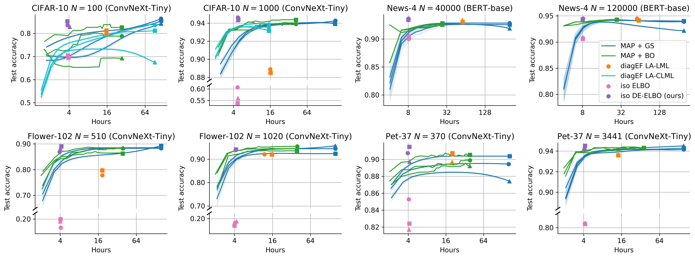

# data-emphasized-ELBo
[Learning the Regularization Strength for Deep Fine-Tuning via a Data-Emphasized Variational Objective]() by Ethan Harvey*, Mikhail Petrov*, and Michael C. Hughes

Figure 2: Test-set accuracy on CIFAR-10 (top row) and Oxford-IIIT Pets (bottom row) over training time for L2-SP with *MAP + grid search (GS)* and our *data-emphasized ELBo* (DE ELBo). We run each method on 3 separate training sets of size N (3 different marker styles). **Takeaway: Our DE ELBo achieves as good or better performance at small dataset sizes and similar performance at large dataset sizes with far less compute time.** To make the blue curves, we did the full grid search once (markers). Then, at each given shorter compute time, we subsampled a fraction of all hyperparameter configurations with that runtime and chose the best via validation NLL. Averaging this over 500 subsamples at each runtime created each blue line.
