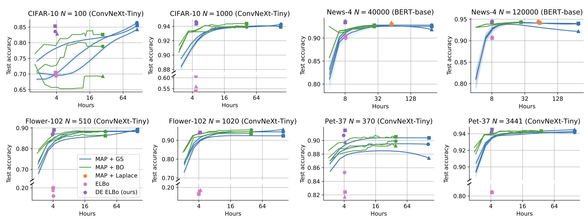

# data-emphasized-ELBo
Bayesian Model Selection via a Data-Emphasized Variational Objective by Anonymous Authors


Figure 2: Test accuracy over time for L2-SP transfer learning methods. Each panel shows a different task: CIFAR-10, Flower-102, and Pet-37 with ConvNeXt-Tiny and News-4 with BERT-base. We run each method on 3 separate training sets of size N (3 different marker styles). **Takeaway: After just a few hours, our DE ELBo achieves as good or better performance at small data sizes and similar performance at large sizes, even when other methods are given many additional hours.**

# Installing environment
```
conda env create -f l3d_24f_cuda.yml
conda activate l3d_24f_cuda
```

# Rerunning experiments
Scripts to rerun all experiments are printed out in notebooks (e.g., all scripts for CIFAR-10 variational inference experiments can be found in `CIFAR-10_VI.ipynb`).
