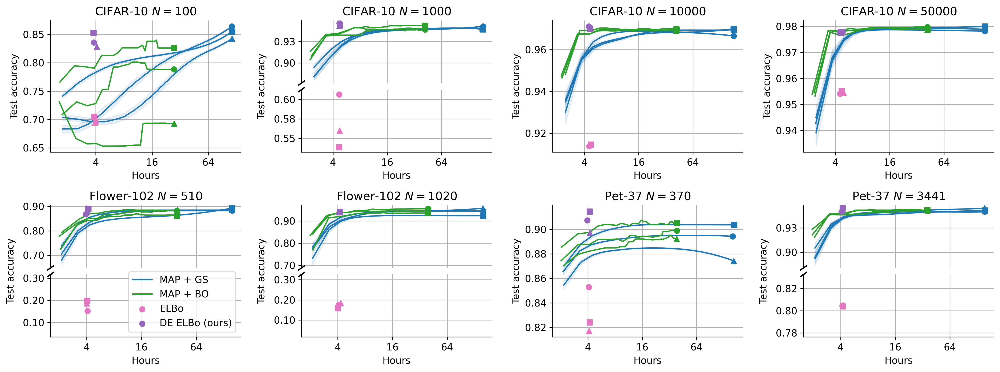

# data-emphasized-ELBo
Bayesian Model Selection via a Data-Emphasized Variational Objective by Anonymous Authors


Figure 2: Test accuracy over time for L2-SP transfer learning methods. We run each method on 3 separate training sets of size N (3 different marker styles). **Takeaway: After just a few hours, our DE ELBo achieves as good or better performance at small data sizes and similar performance at large sizes, even when other methods are given many additional hours.**

# Installing environment
```
conda env create -f l3d_24f_cuda.yml
conda activate l3d_24f_cuda
```
