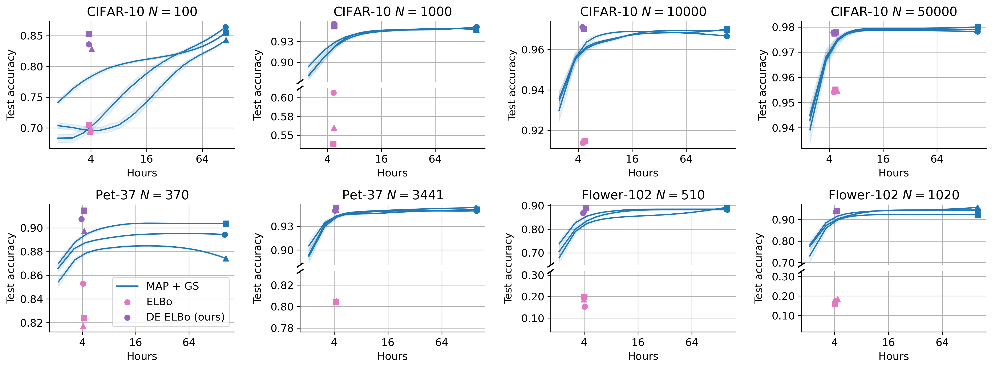

# data-emphasized-ELBo
Learning Hyperparameters via a Data-Emphasized Variational Objective by Anonymous Authors

Figure 3: Test-set accuracy on CIFAR-10, Pet-37, and Flower-102 over training time for L2-SP with MAP + grid search (GS) and our data-emphasized ELBo (DE ELBo) using a ConvNeXt-Tiny (see ViT-B/16 in Fig. 5 and ResNet-50 in Fig. 6). We run each method on 3 separate training sets of size N (3 different marker styles). **Takeaway: Our DE ELBo achieves as good or better performance at small dataset sizes and similar performance at large dataset sizes with far less compute time.** To make the blue curves, we did the full grid search once (markers). Then, at each given shorter compute time, we subsampled a fraction of all hyperparameter configurations with that runtime and chose the best via validation NLL. Averaging this over 500 subsamples at each runtime created each blue line.